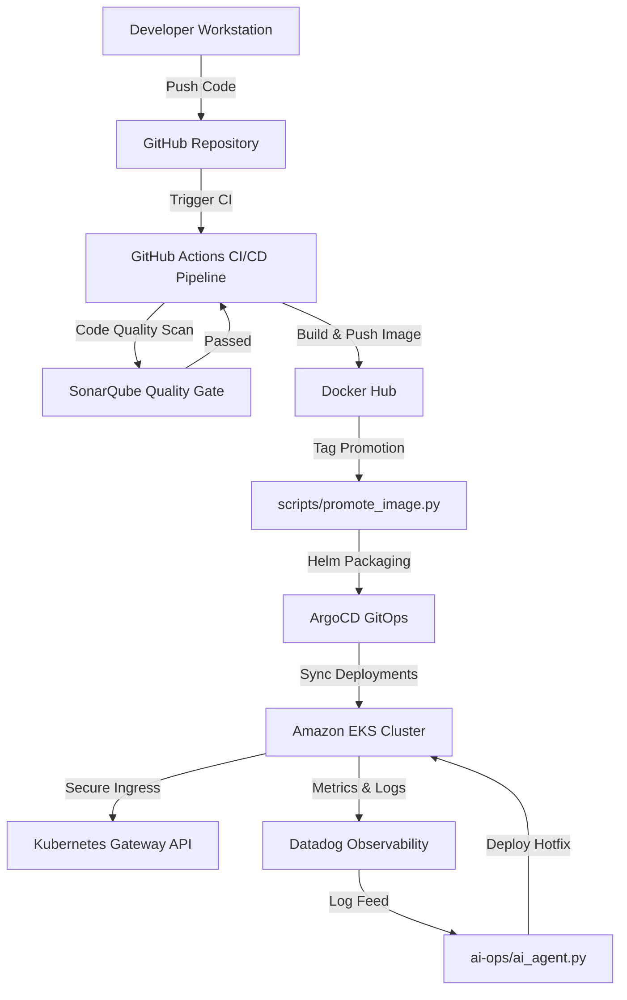

# FitTrack Pro - DevOps & GitOps Capstone Platform

This repository contains the complete, production-grade DevOps and GitOps automation suite built around the cloud-native **FitTrack Pro** fitness tracking application.

---

## 🏗️ DevOps Architecture Flow



---

## 📁 Repository Structure

The DevOps assets are organized into structured directories:

* 📂 **`.github/workflows/`**: Continuous Integration pipeline configuration ([ci.yml](file:///C:/Users/jeeva/Desktop/file/capstone/Fitness_Tracker/.github/workflows/ci.yml)).
* 📂 **`kubernetes/`**: Base Kubernetes manifests including Deployments, Services, PVC, PV, and Gateway API.
* 📂 **`Fitness_Chart/`**: Parameterized Helm Charts supporting `values-dev.yaml`, `values-staging.yaml`, and `values-prod.yaml`.
* 📂 **`argocd/`**: Application definition for continuous GitOps synchronization.
* 📂 **`datadog/`**: Observability JSON dashboard mapping core cluster and APM metrics.
* 📂 **`scripts/`**: Automation tools including the python script for Docker image promotion ([promote_image.py](file:///C:/Users/jeeva/Desktop/file/capstone/Fitness_Tracker/scripts/promote_image.py)).
* 📂 **`ai-ops/`**: Automated log scanning and self-healing SRE CLI agent ([ai_agent.py](file:///C:/Users/jeeva/Desktop/file/capstone/Fitness_Tracker/ai-ops/ai_agent.py)).
* 📂 **`docs/`**: Deliverable documentation for Agile backlog mapping, SCM strategy, and SonarQube checks.

---

## 🚀 Usage Guide

### Phase 1: SCM & Agile (Deliverables 1, 2)
For Agile backlog structures and branch rules, refer to:
* 📄 [Agile Jira Setup Document](file:///C:/Users/jeeva/Desktop/file/capstone/Fitness_Tracker/docs/jira_dashboard.md)
* 📄 [SCM Branching & PR Strategy](file:///C:/Users/jeeva/Desktop/file/capstone/Fitness_Tracker/docs/github_strategy.md)

---

### Phase 2: CI Pipeline & Code Quality (Deliverables 3, 4)
* **SonarQube Configuration:** [sonar-project.properties](file:///C:/Users/jeeva/Desktop/file/capstone/Fitness_Tracker/sonar-project.properties)
* **GitHub Actions Workflow:** [.github/workflows/ci.yml](file:///C:/Users/jeeva/Desktop/file/capstone/Fitness_Tracker/.github/workflows/ci.yml)
* **Sample Quality Report:** [docs/sonarqube_report.md](file:///C:/Users/jeeva/Desktop/file/capstone/Fitness_Tracker/docs/sonarqube_report.md)

To run the Sonar Scanner locally:
```bash
sonar-scanner -Dsonar.projectKey=fitness-tracker-app -Dsonar.sources=server,public -Dsonar.host.url=http://your-sonar-server:9000
```

---

### Phase 3: Docker & Tag Promotion (Deliverables 5, 6)
We build from [Dockerfile](file:///C:/Users/jeeva/Desktop/file/capstone/Fitness_Tracker/Dockerfile).
To promote the same Docker image from **development** to **production** without triggering a new build run:
```bash
python scripts/promote_image.py \
  --source-repo pulkit197/fitness_tracker-fitness-app \
  --target-repo pulkit197/fitness-tracker-prod \
  --tag develop \
  --target-tag latest \
  --user <registry_username> \
  --password <registry_password>
```
*Activity logs will save directly to `promotion.log`.*

---

### Phase 4: Kubernetes & Gateway API (Deliverables 7, 10)
To install the raw Kubernetes resources in your cluster:
```bash
kubectl apply -f kubernetes/namespace.yaml
kubectl apply -f kubernetes/secrets.yaml
kubectl apply -f kubernetes/configmap.yaml
kubectl apply -f kubernetes/mongodb-deployment.yaml
kubectl apply -f kubernetes/app-deployment.yaml
kubectl apply -f kubernetes/kgateway.yaml
```

---

### Phase 5: Helm & ArgoCD GitOps (Deliverables 8, 9)
Verify and test the Helm configuration:
```bash
# Lint chart configuration
helm lint Fitness_Chart/

# Dry-run template generation for Production environment
helm template fitness-prod Fitness_Chart/ -f Fitness_Chart/values-prod.yaml
```

To sync your cluster continuously using ArgoCD, apply the application definition:
```bash
kubectl apply -f argocd/application.yaml
```

---

### Phase 6: Monitoring & AI Ops (Deliverables 11, 12, 13)
* **Datadog:** Import the dashboard layout directly via [datadog/dashboard.json](file:///C:/Users/jeeva/Desktop/file/capstone/Fitness_Tracker/datadog/dashboard.json).
* **AI Operations Troubleshooting:** Use the SRE agent to scan logs and create hotfix/recovery scripts.

**Run the AI Ops Agent:**
```bash
# Scan a log file
python ai-ops/ai_agent.py --log-file error.log

# Or pipe output directly from standard input (e.g., k8s pod logs)
kubectl logs deployment/fitness-tracker-app -n fitness-tracker | python ai-ops/ai_agent.py
```
*If a known issue like a Database Connection failure is found, the agent will diagnose it and generate `auto_recover.sh` to resolve it.*

---

## 🛠️ Local Development (Docker Compose)

To start the entire application stack locally using Docker Compose:
```bash
# Build and run services
npm run compose:up

# Check logs
npm run compose:logs

# Clean up services
npm run compose:down
```
Access the dashboard locally at `http://localhost:5000`.
