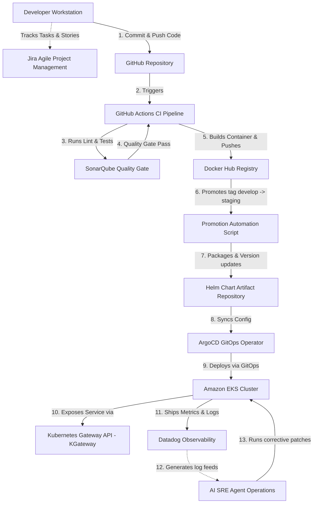

# Enterprise DevOps Architecture Flow

This document details the software delivery lifecycle flow, from local development commits to cloud monitoring and automated operations, using a Mermaid flowchart.

---

## Process Breakdown

1. **Jira Agile Project Management:** Tracks the sprint backlog, assigning Epics, Stories, and Tasks to developers.
2. **GitHub SCM Strategy:** Code is merged into `develop` through PR approval gates.
3. **Continuous Integration (GitHub Actions):** Automates dependencies, runs standard ESLint checks, and triggers SonarQube quality analysis.
4. **SonarQube Quality Gate:** Blocks builds containing high tech debt or open security holes.
5. **Docker Build & Registry:** Standardizes the app environment. The image promotion script tags and moves validated images across stages (Dev ➔ Staging ➔ Production) without rebuilds.
6. **GitOps CD (ArgoCD):** Deploys packaged Helm chart configurations into Amazon EKS namespaces, ensuring self-healing and synchronicity with Git.
7. **KGateway Traffic Handling:** Restricts external traffic, routing it securely to the App backend services inside EKS.
8. **Datadog Observability:** Displays live performance data, warning of memory issues or db outages.
9. **AI SRE Agent Operations:** Analyzes log failures to resolve and patch runtime clusters automatically.
