# Jira Agile Project Management System

This document represents the Jira Agile Project Management setup for the Enterprise DevOps Capstone Project. It defines the project structure including Epics, User Stories, Tasks, and Sub-tasks across the software engineering and DevOps lifecycle.

---

## Project Settings
* **Project Name:** FitTrack DevOps Platform (FTDP)
* **Project Key:** FTDP
* **Project Type:** Software Development (Scrum)
* **Workflow:** To Do ➔ In Progress ➔ Under Review (PR) ➔ QA Testing ➔ Done

---

## Agile Board Hierarchy

```mermaid
graph TD
    Epic1[Epic 1: Agile & SCM Setup] --> Story1[Story: SCM Branching Strategy]
    Epic2[Epic 2: CI Automation] --> Story2[Story: GitHub Actions Pipeline]
    Epic2 --> Story3[Story: SonarQube Code Quality]
    Epic3[Epic 3: Containerization] --> Story4[Story: Docker Multi-Environment Build]
    Epic3 --> Story5[Story: Docker Promotion Automation]
    Epic4[Epic 4: Kubernetes & Gateway] --> Story6[Story: EKS Cluster Resources]
    Epic4 --> Story7[Story: Gateway Routing Implementation]
    Epic5[Epic 5: GitOps & Helm] --> Story8[Story: Helm Charts Packaging]
    Epic5 --> Story9[Story: ArgoCD Continuous Deployment]
    Epic6[Epic 6: Observability & AI Ops] --> Story10[Story: Datadog Observability]
    Epic6 --> Story11[Story: AI Ops Troubleshooting Agent]
```

---

## Epics, Stories, Tasks, and Sub-tasks Breakdown

### Epic 1: Agile & Source Code Management (FTDP-EPIC-01)
* **Description:** Set up project board, git workflow, and branch protection rules for secure collaboration.

#### ➔ User Story: Git Branching and Pull Request Strategy (FTDP-01)
* **As a** DevOps Lead  
* **I want to** establish a standard branching strategy with pull request checks  
* **So that** developers can collaborate safely without breaking the main codebase.
* **Acceptance Criteria:**
  - Standard branching model documented (`master`, `staging`, `develop`, `feature/*`).
  - GitHub branch protection rules enabled for `master` and `develop`.
  - Pull requests require at least 1 peer approval and successful CI check before merge.

  * **Task (FTDP-01-T1):** Define Git Branching Strategy
    * *Sub-task:* Draft SCM branching guidelines.
    * *Sub-task:* Configure GitHub branch protection rules.
  * **Task (FTDP-01-T2):** Establish Pull Request templates
    * *Sub-task:* Create `.github/pull_request_template.md`.

---

### Epic 2: Continuous Integration Automation (FTDP-EPIC-02)
* **Description:** Automate compilation, code checks, testing, and vulnerability scans.

#### ➔ User Story: CI Pipeline Implementation (FTDP-02)
* **As a** Software Engineer  
* **I want to** run automatic checks on every commit  
* **So that** bugs and code issues are caught immediately.
* **Acceptance Criteria:**
  - GitHub Actions runs automatically on PRs to `develop` and `master`.
  - Pipeline executes linting and runs unit tests.
  - Builds the Node.js application successfully.

  * **Task (FTDP-02-T1):** Write GitHub Actions Workflow
    * *Sub-task:* Configure Node.js environment setup.
    * *Sub-task:* Write CI jobs for installation, linting, and testing.

#### ➔ User Story: SonarQube Quality Gate Integration (FTDP-03)
* **As a** Security Engineer  
* **I want** static analysis to block builds failing quality metrics  
* **So that** technical debt, vulnerabilities, and bugs are kept out of production.
* **Acceptance Criteria:**
  - SonarScanner runs inside the GitHub Actions pipeline.
  - Quality Gate status (code smells, bugs, coverage) is fetched.
  - CI fails if SonarQube Quality Gate status is "FAILED".

  * **Task (FTDP-03-T1):** Configure SonarQube Scanner
    * *Sub-task:* Add `sonar-project.properties` configuration.
    * *Sub-task:* Integrate SonarQube scan job into GitHub Actions pipeline.

---

### Epic 3: Container Management & Image Promotion (FTDP-EPIC-03)
* **Description:** Containerize the application and build automated image promotion mechanisms.

#### ➔ User Story: Multi-Stage Containerization (FTDP-04)
* **As a** Platform Engineer  
* **I want to** containerize the Fitness Tracker application using Docker  
* **So that** it runs consistently across dev, staging, and production environments.
* **Acceptance Criteria:**
  - Dockerfile builds successfully using minimal Node.js base image.
  - Docker Compose orchestrates app and MongoDB locally.

  * **Task (FTDP-04-T1):** Optimize Dockerfile
    * *Sub-task:* Create lightweight multi-stage Dockerfile.
    * *Sub-task:* Set up Docker Compose for local testing.

#### ➔ User Story: Docker Image Promotion Automation (FTDP-05)
* **As a** Release Manager  
* **I want** a tool to promote a validated image from dev to prod registry  
* **So that** we deploy the exact same binary that was tested in dev without rebuilding.
* **Acceptance Criteria:**
  - Automation script accepts source image, target image, and tags.
  - Script performs pull, tag, push, and validation steps.
  - Promotion activity logged successfully.

  * **Task (FTDP-05-T1):** Develop Python Image Promotion Script
    * *Sub-task:* Implement command-line parser and registry authentication.
    * *Sub-task:* Implement pull-tag-push logic with logging.

---

### Epic 4: Kubernetes Orchestration & Gateway (FTDP-EPIC-04)
* **Description:** Deploy to EKS cluster and implement Gateway API for traffic routing.

#### ➔ User Story: Kubernetes Platform Manifests (FTDP-06)
* **As a** Kubernetes Administrator  
* **I want to** create deployment configurations for the app and database  
* **So that** Kubernetes manages scalability and high availability.
* **Acceptance Criteria:**
  - Deployments configure replicas, health checks, and resource limits.
  - ConfigMaps and Secrets store configuration variables.
  - MongoDB database uses persistent storage volumes (PV/PVC).

  * **Task (FTDP-06-T1):** Write K8s Resource Manifests
    * *Sub-task:* Create ConfigMap and Secret manifests.
    * *Sub-task:* Write App and MongoDB Deployments.
    * *Sub-task:* Configure Persistent Volume Claims for MongoDB.

#### ➔ User Story: KGateway API Traffic Routing (FTDP-07)
* **As a** Security & Network Engineer  
* **I want** to route external traffic securely into the application  
* **So that** users can access FitTrack safely from the web.
* **Acceptance Criteria:**
  - Expose application using standard Gateway API resources (`Gateway`, `HTTPRoute`).
  - Configure path routing to the app's Service.

  * **Task (FTDP-07-T1):** Define KGateway Configuration
    * *Sub-task:* Create standard `Gateway` resource definition.
    * *Sub-task:* Write `HTTPRoute` manifest pointing to application service.

---

### Epic 5: Package Management & GitOps Deployment (FTDP-EPIC-05)
* **Description:** Package manifests as Helm charts and deploy via ArgoCD GitOps.

#### ➔ User Story: Helm Charts Environment Parameterization (FTDP-08)
* **As a** Platform Engineer  
* **I want** to package Kubernetes manifests into a single Helm Chart  
* **So that** I can deploy to dev, staging, and prod using parameter overrides.
* **Acceptance Criteria:**
  - Chart templates use dynamic variables from values files.
  - Environment override values (`values-dev.yaml`, `values-staging.yaml`, `values-prod.yaml`) created.

  * **Task (FTDP-08-T1):** Parameterize Helm Templates
    * *Sub-task:* Define reusable helper templates in `_helpers.tpl`.
    * *Sub-task:* Create values files for Dev, Staging, and Production.

#### ➔ User Story: ArgoCD Continuous Deployment (FTDP-09)
* **As a** DevOps Engineer  
* **I want** ArgoCD to continuously sync the Git repository state to the cluster  
* **So that** deployment matches git configuration and configuration drifts auto-heal.
* **Acceptance Criteria:**
  - ArgoCD Application resource defined in git.
  - Auto-sync, prune, and self-healing behaviors configured.

  * **Task (FTDP-09-T1):** Define ArgoCD Application CRD
    * *Sub-task:* Create `argocd/application.yaml` manifest.

---

### Epic 6: Observability & AI Operations (FTDP-EPIC-06)
* **Description:** Implement Datadog metrics/logs monitoring and a custom SRE troubleshooting AI assistant.

#### ➔ User Story: Datadog Monitoring Dashboard (FTDP-10)
* **As an** SRE  
* **I want** a unified monitoring dashboard  
* **So that** I can track CPU/Memory metrics, request error rates, and log traces.
* **Acceptance Criteria:**
  - JSON dashboard configuration created.
  - Widgets for system resource metrics, HTTP status codes, and APM tracking.

  * **Task (FTDP-10-T1):** Build Observability Dashboard Config
    * *Sub-task:* Export structured Datadog dashboard JSON.

#### ➔ User Story: AI Agent for SRE Troubleshooting (FTDP-11)
* **As a** Operations Engineer  
* **I want** an AI agent to analyze cluster logs and provide resolutions  
* **So that** I can identify database connection errors and automatically deploy fixes.
* **Acceptance Criteria:**
  - Python CLI tool scans logs.
  - Explains errors in plain language.
  - Outputs a script or command to resolve the issue.

  * **Task (FTDP-11-T1):** Write AI Agent for Operations
    * *Sub-task:* Create log scanning and parsing utility in Python.
    * *Sub-task:* Implement reasoning logic and SRE script generation.
